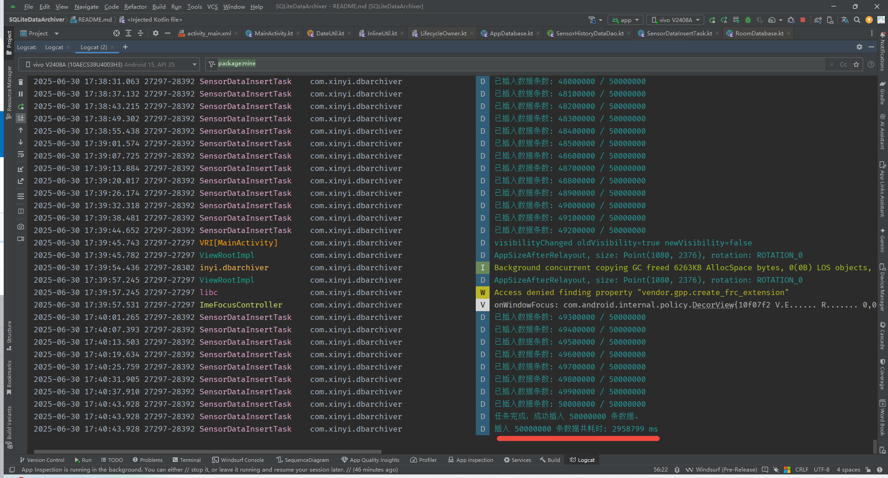
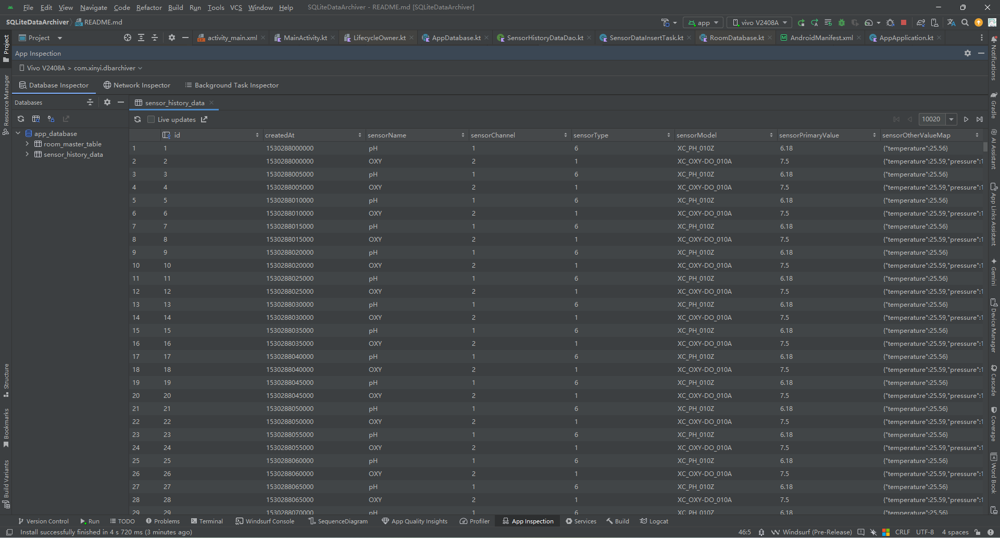
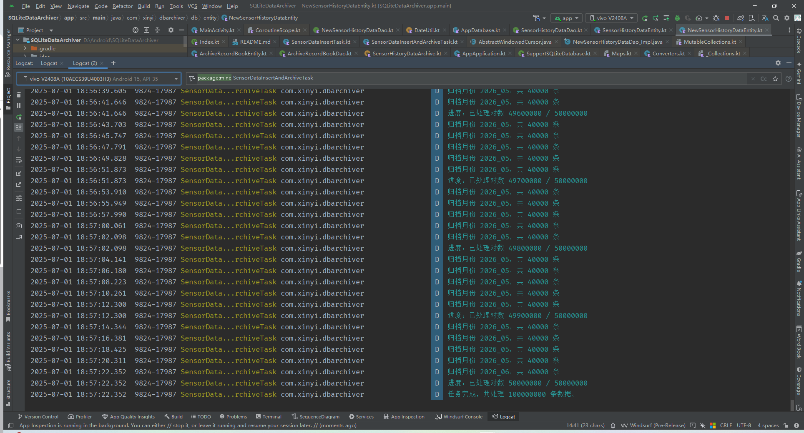
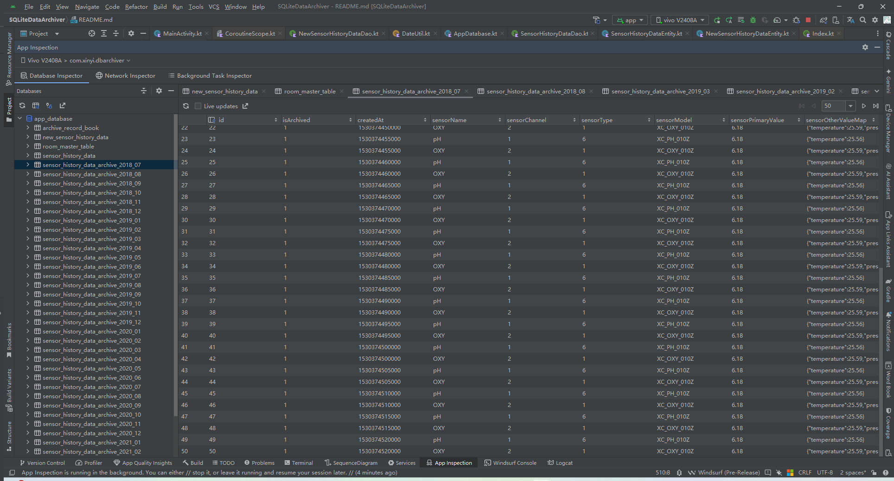

# SQLite 亿量级数据管理方案
本文档将记录在 Android 平台中，基于 Room 框架与 SQLite 数据库进行亿级数据存储与查询的全过程测试
---

## 第一阶段测试目标
- 验证 SQLite 在单表中存储、插入、查询上亿条数据的可行性;
- 评估 SQLite 在超大数据量下的性能瓶颈;
- 为后续归档策略和索引优化提供依据;
---

## 1. 表结构设计
使用 Room 声明如下实体类

```kotlin
/**
 * 传感器历史数据表结构的实体类
 *
 * @author 新一
 * @since 2025/6/30 13:30
 */
@Entity(tableName = "sensor_history_data")
class SensorHistoryDataEntity(
    /** 自增主键 */
    @PrimaryKey(autoGenerate = true) val id: Long = 0,
    /** 创建时间 */
    val createdAt: Long = System.currentTimeMillis(),
    /** 传感器名称 */
    val sensorName: String,
    /** 传感器通道号 */
    val sensorChannel: Int,
    /** 传感器类型 */
    val sensorType: Int,
    /** 传感器型号 */
    val sensorModel: String,
    /** 传感器主测量值 */
    val sensorPrimaryValue: Double = 0.0,
    /** 传感器其他测量值(键值对) */
    val sensorOtherValueMap: Map<String, Double> = emptyMap(),
)
```

## 2. 第二步：插入一亿条数据
使用 `SensorDataInsertTask` 任务类插入一亿条模拟数据，每次批量插入2万条数据。
**（这里我经过了多次测试，插100万会OOM，插50万太慢，所以就2万吧，至少对GC友好一点）**

手机参数
- iQOO 13
- CPU 3nm工艺、骁龙8至尊版移动平台 八核
- RAM 16GB
- ROM 512GB

```kotlin
private fun initParams() {
    // 插入模拟数据, 每种5000万，每条数据间隔5秒，任务模拟任务类中每次会分别插入一条pH和OXY，所以实际数据量为1个亿
    val task = SensorDataInsertTask(
        dao = AppApplication.dataBase.getSensorHistoricalDao(),
        // 7年前的今天开始插入
        startTime = DateUtil.getTimestampYearsAgo(7),
        totalCount = 5000_0000,
    )
    lifecycleScope.launch {
        task.run()
    }
}
```

### 2.1 插入完成
插入了 100_000_000 条数据，一共耗费了 2958799 ms，也就是约等于 2958 秒，共计 49.31 分钟。


大约占用了手机7.64个G的存储空间。

### 2.2 模拟的两种假数据展示


#### pH
- 传感器名称: pH
- 传感器通道号: 1
- 传感器类型: 0x06
- 传感器型号: XC_PH_010Z
- 传感器主测量值: 6.18
- 传感器其他测量值(键值对): mapOf(KEY_TEMPERATURE to 25.56)

#### OXY
- 传感器名称: OXY
- 传感器通道号: 2
- 传感器类型: 0x01
- 传感器型号: XC_OXY_010Z
- 传感器主测量值: 6.18
- 传感器其他测量值(键值对): mapOf(KEY_TEMPERATURE to 25.59, KEY_PRESSURE to 100.14)

## 3. 查询测试
首先1亿条数据，pH和Oxy分别5000万条，且时间线一致，5秒一次间隔。
也就是说oxy和ph分别一天有24*60*60=86400秒，86400 / 5 = 17280 条数据。
5000万 / 17280 ≈ 28.93万，28.93万 / 365 ≈ 7.92年

### 3.1 查询1号通道pH && 2号通道OXY数据有多少条
```kotlin
// 历史数据的dao层接口
val dao = AppApplication.dataBase.getSensorHistoricalDao()

lifecycleScope.launchWithTiming(tag = TAG, label = "查询1号通道 pH") {
    val count = dao.queryCount("pH", 1)
    Log.d(TAG, "1号通道 pH 的数据有: $count 条")
}

lifecycleScope.launchWithTiming(tag = TAG, label = "查询2号通道 OXY") {
    val count = dao.queryCount("OXY", 2)
    Log.d(TAG, "2号通道 OXY 的数据有: $count 条")
}
```

日志打印如下：
```text
第一次：
2025-06-30 17:43:31.731 28488-28488 MainActivity            com.xinyi.dbarchiver                 D  1号通道 pH 的数据有: 50000000 条
2025-06-30 17:43:31.731 28488-28488 MainActivity            com.xinyi.dbarchiver                 D  查询1号通道 pH 耗时: 16067 毫秒
2025-06-30 17:43:31.732 28488-28488 MainActivity            com.xinyi.dbarchiver                 D  2号通道 OXY 的数据有: 50000000 条
2025-06-30 17:43:31.732 28488-28488 MainActivity            com.xinyi.dbarchiver                 D  查询2号通道 OXY 耗时: 16066 毫秒

第二次：
2025-07-01 08:44:37.870 13183-13183 MainActivity            com.xinyi.dbarchiver                 D  1号通道 pH 的数据有: 50000000 条
2025-07-01 08:44:37.870 13183-13183 MainActivity            com.xinyi.dbarchiver                 D  查询1号通道 pH 耗时: 13904 毫秒
2025-07-01 08:44:37.871 13183-13183 MainActivity            com.xinyi.dbarchiver                 D  2号通道 OXY 的数据有: 50000000 条
2025-07-01 08:44:37.871 13183-13183 MainActivity            com.xinyi.dbarchiver                 D  查询2号通道 OXY 耗时: 13904 毫秒

第三次：
2025-07-01 08:46:24.923 29023-29023 MainActivity            com.xinyi.dbarchiver                 D  1号通道 pH 的数据有: 50000000 条
2025-07-01 08:46:24.923 29023-29023 MainActivity            com.xinyi.dbarchiver                 D  查询1号通道 pH 耗时: 14128 毫秒
2025-07-01 08:46:24.927 29023-29023 MainActivity            com.xinyi.dbarchiver                 D  2号通道 OXY 的数据有: 50000000 条
2025-07-01 08:46:24.927 29023-29023 MainActivity            com.xinyi.dbarchiver                 D  查询2号通道 OXY 耗时: 14131 毫秒
```

**平均耗时统计**
| 维度             | 平均耗时 (ms)                      |
|------------------|------------------------------------|
| **pH 总平均**     | (16067 + 13904 + 14128) / 3 = 14666 ms |
| **OXY 总平均**    | (16066 + 13904 + 14131) / 3 = 14700 ms |
| **查询整体平均**  | (6 次总和 / 6 次) = 14683 ms ≈ **14.7 秒** |

### 3.2 查询其中一个传感器通道在某一天的所有数据
先查询pH传感器通道在2025年6月30日和2018年6月30日一天的所有数据
```kotlin
// 查询pH传感器通道在某一天的所有数据
lifecycleScope.launchWithTiming(tag = TAG, label = "查询1号通道 pH 一天的数据") {
    val list = dao.queryInRange(
        "pH", 1,
        DateUtil.getStartOfDayTimestamp(2025, 6, 30),
        DateUtil.getEndOfDayTimestamp(2025, 6, 30)
    )
    Log.d(TAG, "1号通道 pH 在2025年6月30日一天的数据有: ${list.size} 条")
}

lifecycleScope.launchWithTiming(tag = TAG, label = "查询1号通道 pH 一天的数据") {
    val list = dao.queryInRange(
        "pH", 1,
        DateUtil.getStartOfDayTimestamp(2018, 6, 30),
        DateUtil.getEndOfDayTimestamp(2018, 6, 30)
    )
    Log.d(TAG, "1号通道 pH 在2018年6月30日一天的数据有: ${list.size} 条")
}
```

日志：
```text
2025-07-01 09:01:54.050  4300-4300  MainActivity            com.xinyi.dbarchiver                 D  1号通道 pH 在2025年6月30日一天的数据有: 17280 条
2025-07-01 09:01:54.050  4300-4300  MainActivity            com.xinyi.dbarchiver                 D  查询1号通道 pH 一天的数据 耗时: 19795 毫秒

2025-07-01 09:05:13.651  6362-6362  MainActivity            com.xinyi.dbarchiver                 D  1号通道 pH 在2018年6月30日一天的数据有: 17280 条
2025-07-01 09:05:13.651  6362-6362  MainActivity            com.xinyi.dbarchiver                 D  查询1号通道 pH 一天的数据 耗时: 22418 毫秒
```

再查询OXY传感器通道在2025年6月30日和2018年6月30日一天的所有数据
```kotlin
// 查询OXY传感器通道在某一天的所有数据
lifecycleScope.launchWithTiming(tag = TAG, label = "查询2号通道 OXY 一天的数据") {
    val list = dao.queryInRange(
        "OXY", 2,
        DateUtil.getStartOfDayTimestamp(2025, 6, 30),
        DateUtil.getEndOfDayTimestamp(2025, 6, 30)
    )
    Log.d(TAG, "2号通道 OXY 在2025年6月30日一天的数据有: ${list.size} 条")
}

lifecycleScope.launchWithTiming(tag = TAG, label = "查询2号通道 OXY 一天的数据") {
    val list = dao.queryInRange(
        "OXY", 2,
        DateUtil.getStartOfDayTimestamp(2018, 6, 30),
        DateUtil.getEndOfDayTimestamp(2018, 6, 30)
    )
    Log.d(TAG, "2号通道 OXY 在2018年6月30日一天的数据有: ${list.size} 条")
}
```

日志：
```text
2025-07-01 09:10:36.814 12183-12183 MainActivity            com.xinyi.dbarchiver                 D  2号通道 OXY 在2025年6月30日一天的数据有: 17280 条
2025-07-01 09:10:36.814 12183-12183 MainActivity            com.xinyi.dbarchiver                 D  查询2号通道 OXY 一天的数据 耗时: 22039 毫秒

2025-07-01 09:08:53.855 10965-10965 MainActivity            com.xinyi.dbarchiver                 D  2号通道 OXY 在2018年6月30日一天的数据有: 17280 条
2025-07-01 09:08:53.856 10965-10965 MainActivity            com.xinyi.dbarchiver                 D  查询2号通道 OXY 一天的数据 耗时: 21600 毫秒
```

#### 分页查询
先查询pH传感器通道在2025年6月30日和2018年6月30日一天的第一页的50条数据
```kotlin
// 查询pH传感器通道在某一天的所有数据
lifecycleScope.launchWithTiming(tag = TAG, label = "分页查询1号通道 pH 数据") {
    val list = dao.queryInRangePaged(
        "pH", 1,
        DateUtil.getStartOfDayTimestamp(2025, 6, 30),
        DateUtil.getEndOfDayTimestamp(2025, 6, 30),
        50,
        1
    )
    Log.d(TAG, "1号通道 pH 在2025年6月30日第一页的数据有: ${list.size} 条")
}

lifecycleScope.launchWithTiming(tag = TAG, label = "分页查询1号通道 pH 数据") {
    val list = dao.queryInRangePaged(
        "pH", 1,
        DateUtil.getStartOfDayTimestamp(2018, 6, 30),
        DateUtil.getEndOfDayTimestamp(2018, 6, 30),
        50,
        1
    )
    Log.d(TAG, "1号通道 pH 在2018年6月30日第一页的数据有: ${list.size} 条")
}
```

日志：
```text
2025-07-01 09:18:33.845 12940-12940 MainActivity            com.xinyi.dbarchiver                 D  1号通道 pH 在2025年6月30日第一页的数据有: 50 条
2025-07-01 09:18:33.845 12940-12940 MainActivity            com.xinyi.dbarchiver                 D  分页查询1号通道 pH 数据 耗时: 10351 毫秒

2025-07-01 09:21:54.237 16971-16971 MainActivity            com.xinyi.dbarchiver                 D  1号通道 pH 在2018年6月30日第一页的数据有: 50 条
2025-07-01 09:21:54.237 16971-16971 MainActivity            com.xinyi.dbarchiver                 D  分页查询1号通道 pH 数据 耗时: 8909 毫秒
```

再查询OXY传感器通道在2025年6月30日和2018年6月30日一天的第一页的50条数据
```kotlin
// 查询OXY传感器通道在某一天的所有数据
lifecycleScope.launchWithTiming(tag = TAG, label = "分页查询2号通道 OXY 数据") {
    val list = dao.queryInRangePaged(
        "OXY", 2,
        DateUtil.getStartOfDayTimestamp(2025, 6, 30),
        DateUtil.getEndOfDayTimestamp(2025, 6, 30),
        50,
        1
    )
    Log.d(TAG, "2号通道 OXY 在2025年6月30日第一页的数据有: ${list.size} 条")
}

lifecycleScope.launchWithTiming(tag = TAG, label = "分页查询2号通道 OXY 数据") {
    val list = dao.queryInRangePaged(
        "OXY", 2,
        DateUtil.getStartOfDayTimestamp(2018, 6, 30),
        DateUtil.getEndOfDayTimestamp(2018, 6, 30),
        50,
        1
    )
    Log.d(TAG, "2号通道 OXY 在2018年6月30日第一页的数据有: ${list.size} 条")
}
```
日志：
```text
2025-07-01 09:24:45.908 17808-17808 MainActivity            com.xinyi.dbarchiver                 D  2号通道 OXY 在2025年6月30日第一页的数据有: 50 条
2025-07-01 09:24:45.908 17808-17808 MainActivity            com.xinyi.dbarchiver                 D  分页查询2号通道 OXY 数据 耗时: 10205 毫秒

2025-07-01 09:25:24.744 18018-18018 MainActivity            com.xinyi.dbarchiver                 D  2号通道 OXY 在2018年6月30日第一页的数据有: 50 条
2025-07-01 09:25:24.744 18018-18018 MainActivity            com.xinyi.dbarchiver                 D  分页查询2号通道 OXY 数据 耗时: 10154 毫秒
```

### 3.2 插入性能数据统计

> 通道数据总数查询

| 传感器    | 通道 | 平均耗时            |
|--------|----|-----------------|
| pH     | 1  | 14,666 ms       |
| OXY    | 2  | 14,700 ms       |
| **平均** | -  | **≈ 14,683 ms** |
---

> 单日全量数据查询（17280 条）

| 传感器    | 通道 | 日期         | 耗时              |
|--------|----|------------|-----------------|
| pH     | 1  | 2025-06-30 | 19,795 ms       |
| pH     | 1  | 2018-06-30 | 22,418 ms       |
| OXY    | 2  | 2025-06-30 | 22,039 ms       |
| OXY    | 2  | 2018-06-30 | 21,600 ms       |
| **平均** | -  | -          | **≈ 21,463 ms** |
---

> 分页查询（取 50 条）

| 传感器    | 通道 | 日期         | 耗时             |
|--------|----|------------|----------------|
| pH     | 1  | 2025-06-30 | 10,351 ms      |
| pH     | 1  | 2018-06-30 | 8,909 ms       |
| OXY    | 2  | 2025-06-30 | 10,205 ms      |
| OXY    | 2  | 2018-06-30 | 10,154 ms      |
| **平均** | -  | -          | **≈ 9,904 ms** |
---

## 4. 初步总结

### 查询性能概览
- **全表查询**：单类传感器（共 5000 万条）数据，平均耗时约 **14~15 秒**;
- **单日查询**：某一天的数据量约 17,280 条，平均耗时约 **20~22 秒**;
- **分页查询（每页 50 条）**：平均耗时控制在 **10 秒以内**;
---

### 测试数据特征说明

- 所有数据以 **每 5 秒一条** 的频率生成，时间跨度约 **8 年**;
- 尽管实际业务中，传感器类型更多、采样频率不一、数据分布也更复杂，但需要明确的是：
    - **只要数据总量达到亿级(或高千万级)，无论数据结构如何真实，还原度多高，SQLite 在存储与查询层面遇到的性能挑战都是客观存在的、不可避免的**;
- 本次测试已覆盖：
    - 亿级数据量下的存储与访问压力;
    - 典型的单日范围查询与分页查询组合使用场景;
- 可以断定：**当数据总量达到亿级**时，若不进行结构优化，SQLite 将在混合查询、历史检索、全量统计等操作中暴露出**严重的性能瓶颈**，对响应速度与系统稳定性造成影响。
---

## 第二阶段目标：构建高效的亿级数据管理体系
- 本阶段目标是解决第一阶段中暴露出的查询效率问题。
- 全面优化数据存储结构与访问策略，确保亿级数据场景下的秒级查询响应、低延迟分页、灵活归档能力与可持续扩展性。

## 1. 索引优化策略

**添加索引**
```kotlin
@Entity(
    tableName = "sensor_history_data",
    indices = [Index(value = ["sensorName", "sensorChannel", "createdAt"])]
)
class SensorHistoryDataEntity(
    /** 自增主键 */
    @PrimaryKey(autoGenerate = true) val id: Long = 0,
    /** 创建时间 */
    val createdAt: Long = System.currentTimeMillis(),
    /** 传感器名称 */
    val sensorName: String,
    /** 传感器通道号 */
    val sensorChannel: Int,
    /** 传感器类型 */
    val sensorType: Int,
    /** 传感器型号 */
    val sensorModel: String,
    /** 传感器主测量值 */
    val sensorPrimaryValue: Double = 0.0,
    /** 传感器其他测量值(键值对) */
    val sensorOtherValueMap: Map<String, Double> = emptyMap(),
)
```

**数据库升级**
```kotlin
/**
 * 从数据库版本 1 升级到版本 2 的迁移脚本
 */
object : Migration(1, 2) {

    /**
     * 本次迁移的目的是在 sensor_history_data 表上新增复合索引，
     * 以提升基于 sensorName 和 sensorChannel 的查询性能。
     *
     * @param database SQLite 支持库的数据库实例
     */
    override fun migrate(database: SupportSQLiteDatabase) {
        // 创建索引，避免重复创建使用 IF NOT EXISTS
        database.execSQL(
            "CREATE INDEX IF NOT EXISTS index_sensorName_sensorChannel ON sensor_history_data(sensorName, sensorChannel)"
        )
    }
}
```

> 原本想在已有的数据库上直接升级，添加创建一个索引，但是没想到发生了如下情况：
```text
2025-07-01 10:23:39.492   574-5813  libc                    com.xinyi.dbarchiver                 A  Fatal signal 6 (SIGABRT), code -1 (SI_QUEUE) in tid 5813 (arch_disk_io_0), pid 574 (inyi.dbarchiver)
2025-07-01 10:23:39.492   574-5813  libc                    com.xinyi.dbarchiver                 I  clone child process pid:5965
2025-07-01 10:23:39.493   574-5813  libc                    com.xinyi.dbarchiver                 I  debuggerd pseudothread crash_process: 5813
2025-07-01 10:23:39.712   574-5645  libc                    com.xinyi.dbarchiver                 W  pthread_create failed: couldn't allocate 1064960-bytes mapped space: Out of memory
2025-07-01 10:23:41.231  5970-5970  DEBUG                   pid-5970                             A  Cmdline: com.xinyi.dbarchiver
2025-07-01 10:23:41.231  5970-5970  DEBUG                   pid-5970                             A  pid: 574, tid: 5813, name: arch_disk_io_0  >>> com.xinyi.dbarchiver <<<
2025-07-01 10:23:41.232  5970-5970  DEBUG                   pid-5970                             A        #59 pc 0000000000327c58  /data/app/~~6IlQ1uHQeQ4Fni0VuI-aPw==/com.xinyi.dbarchiver-vSUJqOZZDtBgYgjP5zZ_Aw==/oat/arm64/base.vdex (androidx.sqlite.db.framework.FrameworkSQLiteDatabase.execSQL+0)
2025-07-01 10:23:41.232  5970-5970  DEBUG                   pid-5970                             A        #65 pc 0000000000000b50  /data/data/com.xinyi.dbarchiver/code_cache/.overlay/base.apk/classes5.dex (com.xinyi.dbarchiver.db.AppDatabase$Companion$MIGRATION_1_2$1.migrate+0)
2025-07-01 10:23:41.232  5970-5970  DEBUG                   pid-5970                             A        #71 pc 000000000031fbb4  /data/app/~~6IlQ1uHQeQ4Fni0VuI-aPw==/com.xinyi.dbarchiver-vSUJqOZZDtBgYgjP5zZ_Aw==/oat/arm64/base.vdex (androidx.room.RoomOpenHelper.onUpgrade+0)
2025-07-01 10:23:41.232  5970-5970  DEBUG                   pid-5970                             A        #77 pc 000000000032871c  /data/app/~~6IlQ1uHQeQ4Fni0VuI-aPw==/com.xinyi.dbarchiver-vSUJqOZZDtBgYgjP5zZ_Aw==/oat/arm64/base.vdex (androidx.sqlite.db.framework.FrameworkSQLiteOpenHelper$OpenHelper.onUpgrade+0)
2025-07-01 10:23:41.232  5970-5970  DEBUG                   pid-5970                             A        #95 pc 0000000000328130  /data/app/~~6IlQ1uHQeQ4Fni0VuI-aPw==/com.xinyi.dbarchiver-vSUJqOZZDtBgYgjP5zZ_Aw==/oat/arm64/base.vdex (androidx.sqlite.db.framework.FrameworkSQLiteOpenHelper$OpenHelper.getWritableOrReadableDatabase+0)
2025-07-01 10:23:41.232  5970-5970  DEBUG                   pid-5970                             A        #101 pc 000000000032816c  /data/app/~~6IlQ1uHQeQ4Fni0VuI-aPw==/com.xinyi.dbarchiver-vSUJqOZZDtBgYgjP5zZ_Aw==/oat/arm64/base.vdex (androidx.sqlite.db.framework.FrameworkSQLiteOpenHelper$OpenHelper.innerGetDatabase+0)
2025-07-01 10:23:41.232  5970-5970  DEBUG                   pid-5970                             A        #107 pc 00000000003282f0  /data/app/~~6IlQ1uHQeQ4Fni0VuI-aPw==/com.xinyi.dbarchiver-vSUJqOZZDtBgYgjP5zZ_Aw==/oat/arm64/base.vdex (androidx.sqlite.db.framework.FrameworkSQLiteOpenHelper$OpenHelper.getSupportDatabase+0)
2025-07-01 10:23:41.232  5970-5970  DEBUG                   pid-5970                             A        #113 pc 0000000000328960  /data/app/~~6IlQ1uHQeQ4Fni0VuI-aPw==/com.xinyi.dbarchiver-vSUJqOZZDtBgYgjP5zZ_Aw==/oat/arm64/base.vdex (androidx.sqlite.db.framework.FrameworkSQLiteOpenHelper.getWritableDatabase+0)
2025-07-01 10:23:41.232  5970-5970  DEBUG                   pid-5970                             A        #119 pc 000000000031e9e4  /data/app/~~6IlQ1uHQeQ4Fni0VuI-aPw==/com.xinyi.dbarchiver-vSUJqOZZDtBgYgjP5zZ_Aw==/oat/arm64/base.vdex (androidx.room.RoomDatabase.inTransaction+0)
2025-07-01 10:23:41.232  5970-5970  DEBUG                   pid-5970                             A        #125 pc 000000000031edd4  /data/app/~~6IlQ1uHQeQ4Fni0VuI-aPw==/com.xinyi.dbarchiver-vSUJqOZZDtBgYgjP5zZ_Aw==/oat/arm64/base.vdex (androidx.room.RoomDatabase.assertNotSuspendingTransaction+0)
2025-07-01 10:23:41.232  5970-5970  DEBUG                   pid-5970                             A        #131 pc 000000000031e8bc  /data/app/~~6IlQ1uHQeQ4Fni0VuI-aPw==/com.xinyi.dbarchiver-vSUJqOZZDtBgYgjP5zZ_Aw==/oat/arm64/base.vdex (androidx.room.RoomDatabase.query+0)
2025-07-01 10:23:41.232  5970-5970  DEBUG                   pid-5970                             A        #137 pc 0000000000322430  /data/app/~~6IlQ1uHQeQ4Fni0VuI-aPw==/com.xinyi.dbarchiver-vSUJqOZZDtBgYgjP5zZ_Aw==/oat/arm64/base.vdex (androidx.room.util.DBUtil.query+0)
2025-07-01 10:23:41.232  5970-5970  DEBUG                   pid-5970                             A        #143 pc 0000000000000dcc  /data/data/com.xinyi.dbarchiver/code_cache/.overlay/base.apk/classes9.dex (com.xinyi.dbarchiver.db.dao.SensorHistoryDataDao_Impl$10.call+0)
2025-07-01 10:23:41.232  5970-5970  DEBUG                   pid-5970                             A        #149 pc 0000000000000db0  /data/data/com.xinyi.dbarchiver/code_cache/.overlay/base.apk/classes9.dex (com.xinyi.dbarchiver.db.dao.SensorHistoryDataDao_Impl$10.call+0)
2025-07-01 10:23:41.232  5970-5970  DEBUG                   pid-5970                             A        #155 pc 0000000000316d8c  /data/app/~~6IlQ1uHQeQ4Fni0VuI-aPw==/com.xinyi.dbarchiver-vSUJqOZZDtBgYgjP5zZ_Aw==/oat/arm64/base.vdex (androidx.room.CoroutinesRoom$Companion$execute$4$job$1.invokeSuspend+0)
2025-07-01 10:23:41.232  5970-5970  DEBUG                   pid-5970                             A        #161 pc 00000000004640b0  /data/app/~~6IlQ1uHQeQ4Fni0VuI-aPw==/com.xinyi.dbarchiver-vSUJqOZZDtBgYgjP5zZ_Aw==/oat/arm64/base.vdex (kotlin.coroutines.jvm.internal.BaseContinuationImpl.resumeWith+0)
2025-07-01 10:23:41.232  5970-5970  DEBUG                   pid-5970                             A        #167 pc 00000000004acef4  /data/app/~~6IlQ1uHQeQ4Fni0VuI-aPw==/com.xinyi.dbarchiver-vSUJqOZZDtBgYgjP5zZ_Aw==/oat/arm64/base.vdex (kotlinx.coroutines.DispatchedTask.run+0)
```
数据库升级过程中执行建索引操作时发生内存不足（OOM）导致进程崩溃。
对于亿级规模的数据表，SQLite在创建索引时会扫描整个表，消耗大量临时空间和内存资源。
在资源受限的移动设备上，这一步骤难以顺利完成，导致升级失败。

## 2. 亿量级数据完整管理方案
由于数据库升级过程中索引创建导致内存溢出（OOM）崩溃，无法通过逐步迁移的方式完成优化。
因此，必须放弃分步升级，转而一次性将所有优化策略全部实施，整体实施后再进行性能验证和数据统计吧。

### 2.1 数据归档
全部数据按月归档

- 重新写一个表
```kotlin
@Entity(
    tableName = "new_sensor_history_data",
    indices = [
        Index(value = ["sensorName", "sensorChannel", "createdAt", "sensorType", "sensorModel"])
    ]
)
data class NewSensorHistoryDataEntity(
    /** 自增主键 */
    @PrimaryKey(autoGenerate = true) val id: Long = 0,
    /** 标记是否归档 */
    val isArchived: Boolean = false,
    /** 创建时间 */
    val createdAt: Long = System.currentTimeMillis(),
    /** 传感器名称 */
    val sensorName: String,
    /** 传感器通道号 */
    val sensorChannel: Int,
    /** 传感器类型 */
    val sensorType: Int,
    /** 传感器型号 */
    val sensorModel: String,
    /** 传感器主测量值 */
    val sensorPrimaryValue: Double = 0.0,
    /** 传感器其他测量值(键值对) */
    val sensorOtherValueMap: String = "{}"
)
```

由于归档表是动态创建的，所以这里再新建一个归档表记录册的表
```kotlin
@Entity(
  tableName = "archive_record_book",
  indices = [Index("tableName")]
)
data class ArchiveRecordBookEntity(
  @PrimaryKey val tableName: String,
  /** 归档时间 "yyyy_MM" */
  val monthKey: String,
)
```

> 归档表是动态创建的，名称规则为 `sensor_history_data_{归档日期}`,例如 `sensor_history_data_2025-06-30`。
> 具体代码见 [SensorHistoryDataArchive.kt](app/src/main/java/com/xinyi/dbarchiver/db/archive/SensorHistoryDataArchive.kt)

#### 生成1亿条数据
- 生成1亿条数据，分别插入到主表和归档表中，每个月归档一次。
> 具体代码见 [SensorDataInsertAndArchiveTask.kt](app/src/main/java/com/xinyi/dbarchiver/task/SensorDataInsertAndArchiveTask.kt)

- **生成完成**
插入了 100_000_000 条数据，耗费时间没统计，反正挺久的，大约1个小时多一些。
!

大约占用了手机7.58个G的存储空间。

- **数据库展示**


## 4. 查询测试
将复试之前的测试方法

### 4.1 查询1号通道pH && 2号通道OXY数据有多少条
```kotlin
// 历史数据的dao层接口
SensorHistoryDataManager.instance.getCount("pH", 1).let {
  Log.d(TAG, "1号通道 pH 的数据有: $it 条")
}

SensorHistoryDataManager.instance.getCount("OXY", 2).let {
  Log.d(TAG, "2号通道 OXY 的数据有: $it 条")
}
```

日志打印如下：
```text
第一次：
2025-07-03 14:54:30.598 26152-26152 MainActivity            com.xinyi.dbarchiver                 D  1号通道 pH 的数据有: 50000000 条
2025-07-03 14:54:30.598 26152-26152 MainActivity            com.xinyi.dbarchiver                 D  查询1号通道 pH 耗时: 5337 毫秒
2025-07-03 14:56:16.431  2850-2850  MainActivity            com.xinyi.dbarchiver                 D  2号通道 OXY 的数据有: 50000000 条
2025-07-03 14:56:16.431  2850-2850  MainActivity            com.xinyi.dbarchiver                 D  查询1号通道 pH 耗时: 5627 毫秒

第二次：
2025-07-03 14:54:58.381 26152-26152 MainActivity            com.xinyi.dbarchiver                 D  1号通道 pH 的数据有: 50000000 条
2025-07-03 14:54:58.381 26152-26152 MainActivity            com.xinyi.dbarchiver                 D  查询1号通道 pH 耗时: 5299 毫秒
2025-07-03 14:56:36.066  2850-2850  MainActivity            com.xinyi.dbarchiver                 D  2号通道 OXY 的数据有: 50000000 条
2025-07-03 14:56:36.066  2850-2850  MainActivity            com.xinyi.dbarchiver                 D  查询1号通道 pH 耗时: 5634 毫秒

第三次：
2025-07-03 14:55:12.226 26152-26152 MainActivity            com.xinyi.dbarchiver                 D  1号通道 pH 的数据有: 50000000 条
2025-07-03 14:55:12.226 26152-26152 MainActivity            com.xinyi.dbarchiver                 D  查询1号通道 pH 耗时: 5303 毫秒
2025-07-03 14:56:53.898  2850-2850  MainActivity            com.xinyi.dbarchiver                 D  2号通道 OXY 的数据有: 50000000 条
2025-07-03 14:56:53.898  2850-2850  MainActivity            com.xinyi.dbarchiver                 D  查询1号通道 pH 耗时: 5633 毫秒
```

**平均耗时统计**
| 维度             | 平均耗时 (ms)                                 |
|------------------|----------------------------------------------|
| **pH 总平均**     | (5337 + 5299 + 5303) / 3 = **5313 ms**         |
| **OXY 总平均**    | (5627 + 5634 + 5633) / 3 = **5631 ms**         |
| **查询整体平均**  | (5337 + 5299 + 5303 + 5627 + 5634 + 5633) / 6 = **5472 ms** ≈ **5.5 秒** |

**说明：**
- 本次统计基于 1 亿条历史数据（各通道 5000 万条）。
- 查询实现采用并发批量执行 `COUNT(*)` 统计，结合归档表分表策略，查询效率稳定。
- 在当前架构下，单通道数据统计耗时 **5.5秒左右**，**在亿级数据规模中属于** **高效可用水平**。
- **其实还有更高效的实现方式，可以通过缓存或积极维护归档表记录册表来实现最大效率**
---

### 4.2 查询其中一个传感器通道在某一天的所有数据
先查询pH传感器通道在2025年6月30日和2018年7月1日一天的所有数据
```kotlin
// 查询pH传感器通道在某一天的所有数据
lifecycleScope.launchWithTiming(tag = TAG, label = "查询1号通道 pH") {
  SensorHistoryDataManager.instance.queryInRange(
    "pH",
    1,
    DateUtil.getStartOfDayTimestamp(2025, 6, 30),
    DateUtil.getEndOfDayTimestamp(2025, 6, 30),
  ).let {
    Log.d(TAG, "1号通道 pH 在2025年6月30日一天的数据有: ${it.size} 条")
  }
}
lifecycleScope.launchWithTiming(tag = TAG, label = "查询1号通道 pH") {
  SensorHistoryDataManager.instance.queryInRange(
    "pH",
    1,
    DateUtil.getStartOfDayTimestamp(2018, 7, 1),
    DateUtil.getEndOfDayTimestamp(2018, 7, 1),
  ).let {
    Log.d(TAG, "1号通道 pH 在2018年7月1日一天的数据有: ${it.size} 条")
  }
}
```

日志：
```text
2025-07-03 15:06:16.487 12104-12104 MainActivity            com.xinyi.dbarchiver                 D  1号通道 pH 在2025年6月30日一天的数据有: 17280 条
2025-07-03 15:06:16.487 12104-12104 MainActivity            com.xinyi.dbarchiver                 D  查询1号通道 pH 耗时: 269 毫秒

2025-07-03 15:08:02.054 12945-12945 MainActivity            com.xinyi.dbarchiver                 D  1号通道 pH 在2018年7月1日一天的数据有: 17280 条
2025-07-03 15:08:02.054 12945-12945 MainActivity            com.xinyi.dbarchiver                 D  查询1号通道 pH 耗时: 309 毫秒
```

再查询OXY传感器通道在2025年6月30日和2018年7月1日一天的所有数据
```kotlin
// 查询OXY传感器通道在某一天的所有数据
lifecycleScope.launchWithTiming(tag = TAG, label = "查询2号通道 OXY") {
  SensorHistoryDataManager.instance.queryInRange(
    "OXY",
    2,
    DateUtil.getStartOfDayTimestamp(2025, 6, 30),
    DateUtil.getEndOfDayTimestamp(2025, 6, 30),
  ).let {
    Log.d(TAG, "2号通道 OXY 在2025年6月30日一天的数据有: ${it.size} 条")
  }
}
lifecycleScope.launchWithTiming(tag = TAG, label = "查询2号通道 OXY") {
  SensorHistoryDataManager.instance.queryInRange(
    "OXY",
    2,
    DateUtil.getStartOfDayTimestamp(2018, 7, 1),
    DateUtil.getEndOfDayTimestamp(2018, 7, 1),
  ).let {
    Log.d(TAG, "2号通道 OXY 在2018年7月1日一天的数据有: ${it.size} 条")
  }
}
```

日志：
```text
2025-07-03 15:09:26.778 13883-13883 MainActivity            com.xinyi.dbarchiver                 D  2号通道 OXY 在2025年6月30日一天的数据有: 17280 条
2025-07-03 15:09:26.778 13883-13883 MainActivity            com.xinyi.dbarchiver                 D  查询2号通道 OXY 耗时: 277 毫秒

2025-07-03 15:13:03.622 17651-17651 MainActivity            com.xinyi.dbarchiver                 D  2号通道 OXY 在2018年7月1日一天的数据有: 17280 条
2025-07-03 15:13:03.623 17651-17651 MainActivity            com.xinyi.dbarchiver                 D  查询2号通道 OXY 耗时: 309 毫秒
```

#### 分页查询
先查询pH传感器通道在2025年6月30日和2018年7月1日一天的第一页的50条数据
```kotlin
// 查询pH传感器通道在某一天的所有数据
lifecycleScope.launchWithTiming(tag = TAG, label = "查询1号通道 pH") {
  SensorHistoryDataManager.instance.queryInRangePaged(
    "OXY",
    2,
    DateUtil.getStartOfDayTimestamp(2025, 6, 30),
    DateUtil.getEndOfDayTimestamp(2025, 6, 30),
    50,
    1
  ).let {
    Log.d(TAG, "1号通道 pH 在2025年6月30日第一页的数据有: ${it.size} 条")
  }
}

lifecycleScope.launchWithTiming(tag = TAG, label = "查询1号通道 pH") {
  SensorHistoryDataManager.instance.queryInRangePaged(
    "OXY",
    2,
    DateUtil.getStartOfDayTimestamp(2018, 7, 1),
    DateUtil.getEndOfDayTimestamp(2018, 7, 1),
    50,
    1
  ).let {
    Log.d(TAG, "1号通道 pH 在2018年7月1日第一页的数据有: ${it.size} 条")
  }
}
```

日志：
```text
2025-07-03 15:16:00.296 21783-21783 MainActivity            com.xinyi.dbarchiver                 D  1号通道 pH 在2025年6月30日第一页的数据有: 50 条
2025-07-03 15:16:00.296 21783-21783 MainActivity            com.xinyi.dbarchiver                 D  查询1号通道 pH 耗时: 104 毫秒

2025-07-03 15:17:27.626 22772-22772 MainActivity            com.xinyi.dbarchiver                 D  1号通道 pH 在2018年7月1日第一页的数据有: 50 条
2025-07-03 15:17:27.626 22772-22772 MainActivity            com.xinyi.dbarchiver                 D  查询1号通道 pH 耗时: 116 毫秒
```

再查询OXY传感器通道在2025年6月30日和2018年7月1日一天的第一页的50条数据
```kotlin
// 查询OXY传感器通道在某一天的所有数据
lifecycleScope.launchWithTiming(tag = TAG, label = "查询2号通道 OXY") {
  SensorHistoryDataManager.instance.queryInRangePaged(
    "OXY",
    2,
    DateUtil.getStartOfDayTimestamp(2025, 6, 30),
    DateUtil.getEndOfDayTimestamp(2025, 6, 30),
    50,
    1
  ).let {
    Log.d(TAG, "2号通道 OXY 在2025年6月30日第一页的数据有: ${it.size} 条")
  }
}

lifecycleScope.launchWithTiming(tag = TAG, label = "查询2号通道 OXY") {
  SensorHistoryDataManager.instance.queryInRangePaged(
    "OXY",
    2,
    DateUtil.getStartOfDayTimestamp(2018, 7, 1),
    DateUtil.getEndOfDayTimestamp(2018, 7, 1),
    50,
    1
  ).let {
    Log.d(TAG, "2号通道 OXY 在2018年7月1日第一页的数据有: ${it.size} 条")
  }
}

```
日志：
```text
2025-07-03 15:18:27.263 24561-24561 MainActivity            com.xinyi.dbarchiver                 D  2号通道 OXY 在2025年6月30日第一页的数据有: 50 条
2025-07-03 15:18:27.263 24561-24561 MainActivity            com.xinyi.dbarchiver                 D  查询2号通道 OXY 耗时: 108 毫秒

2025-07-03 15:19:32.609 26272-26272 MainActivity            com.xinyi.dbarchiver                 D  2号通道 OXY 在2018年7月1日第一页的数据有: 50 条
2025-07-03 15:19:32.609 26272-26272 MainActivity            com.xinyi.dbarchiver                 D  查询2号通道 OXY 耗时: 121 毫秒
```

### 4.2 插入性能数据统计

> 通道数据总数查询

| 传感器    | 通道 | 平均耗时          |
|--------|----|---------------|
| pH     | 1  | 5313 ms       |
| OXY    | 2  | 5631 ms       |
| **平均** | -  | **≈ 5472 ms** |
---

> 单日全量数据查询（17280 条）

| 传感器    | 通道 | 日期         | 耗时           |
|--------|----|------------|--------------|
| pH     | 1  | 2025-06-30 | 269 ms       |
| pH     | 1  | 2018-06-30 | 309 ms       |
| OXY    | 2  | 2025-06-30 | 277 ms       |
| OXY    | 2  | 2018-06-30 | 309 ms       |
| **平均** | -  | -          | **≈ 291 ms** |
---

> 分页查询（取 50 条）

| 传感器    | 通道 | 日期         | 耗时           |
|--------|----|------------|--------------|
| pH     | 1  | 2025-06-30 | 104 ms       |
| pH     | 1  | 2018-06-30 | 116 ms       |
| OXY    | 2  | 2025-06-30 | 108 ms       |
| OXY    | 2  | 2018-06-30 | 121 ms       |
| **平均** | -  | -          | **≈ 112 ms** |
---

## 数据对比
| 查询类型       | 查询目标            | 第一阶段平均耗时（ms） | 第二阶段平均耗时（ms） | 性能提升       |
|------------|-----------------|--------------|--------------|------------|
| 通道总数查询     | pH / OXY 共 1 亿条 | ≈ 14,683     | ≈ 5,472      | **62.7%↑** |
| 单日全量查询     | 单通道一天 17,280 条  | ≈ 21,463     | ≈ 291        | **98.6%↑** |
| 分页查询（50 条） | 每页 50 条数据       | ≈ 9,904      | ≈ 112        | **98.9%↑** |
---

## 最终总结
实践表明，只要策略得当——按月分表归档 + 合理的复合索引 + 并发查询，哪怕是移动端面对上亿条数据，SQLite 依然可以跑出秒级甚至毫秒级的查询速度。
既解决了性能瓶颈，也让数据管理更轻松，值得在实际项目中推广使用。
